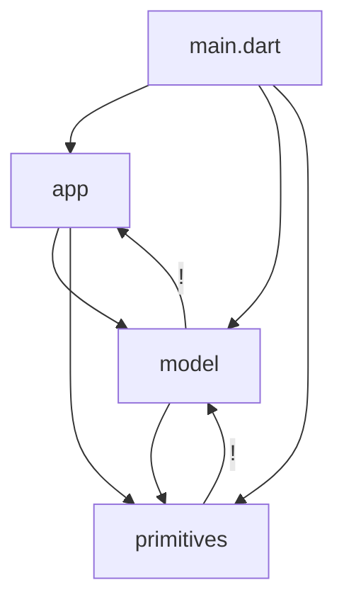

<!---
Generated by https://github.com/polina-c/layerlens
Dependencies that create loops (inversions) are marked with `!`.
-->

```mermaid
flowchart TD;
app-->model;
app-->primitives;
main.dart-->app;
main.dart-->model;
main.dart-->primitives;
model--!-->app;
model-->primitives;
primitives--!-->model;
```

### Inversions
In this folder: 2

Including sub-folders: 2

